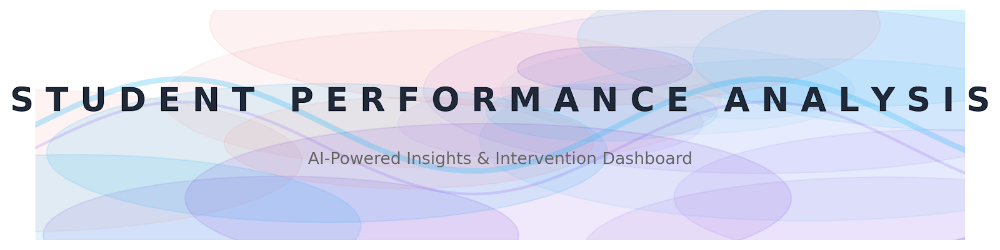
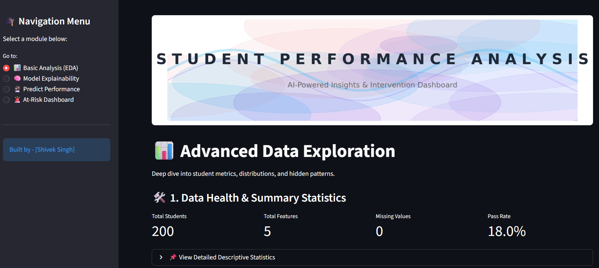
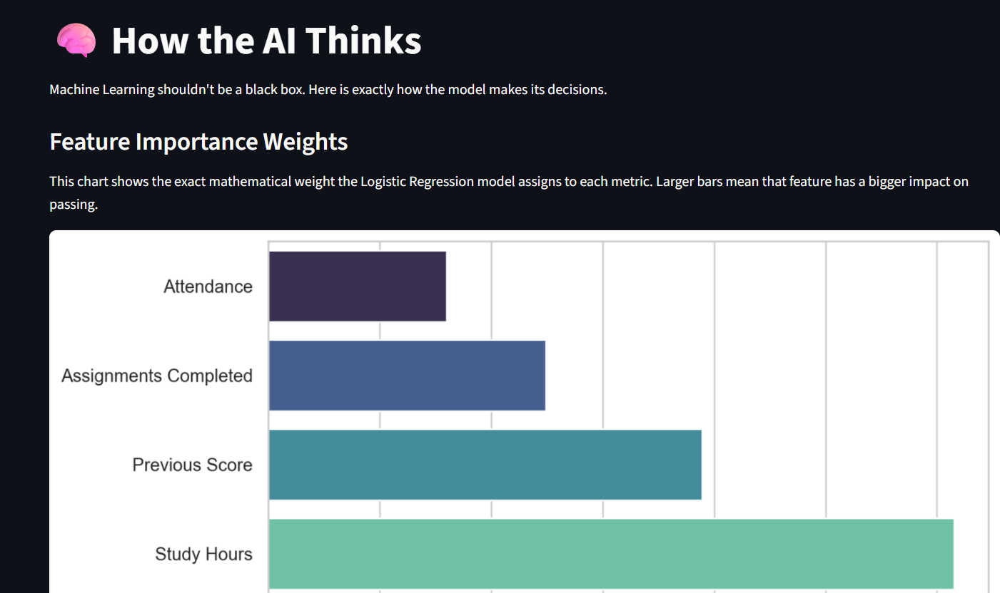
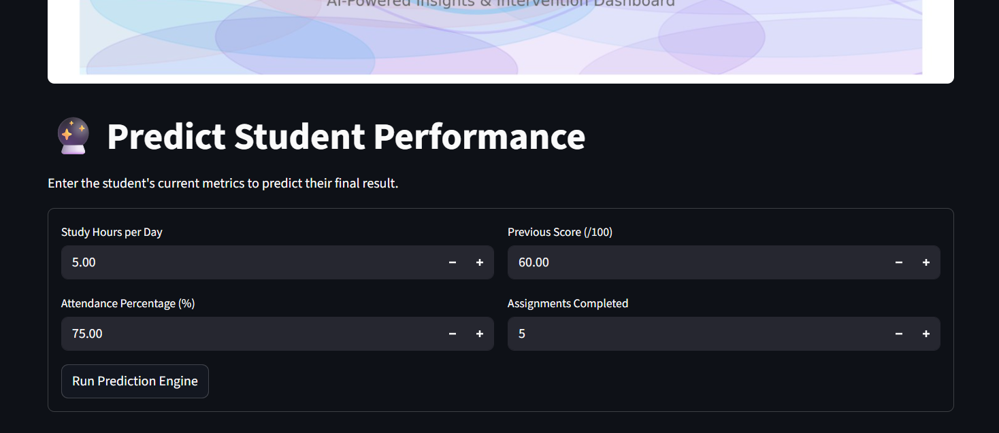
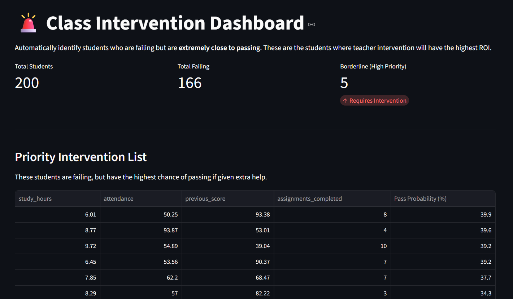

# 🎓 Student Performance Analysis: AI-Powered Insights & Intervention Dashboard


An enterprise-grade Machine Learning dashboard built to predict student academic success and provide educators with actionable intervention strategies. This project goes beyond basic prediction by incorporating **Explainable AI (XAI)** and a **Goal-Seeking Intervention Engine**.

 

---

## 🚀 Key Features

This application is divided into four distinct modules, designed for real-world educational administration:

* **📊 Advanced Exploratory Data Analysis (EDA):** Interactive health metrics, KDE step-histograms, correlation matrices, and box/strip plot overlays to deeply understand student cohorts.
* **🧠 Model Explainability (XAI):** Transparent AI. Extracts and visualizes the exact mathematical weights from the Logistic Regression model, proving *why* the model makes its decisions.
* **🔮 Predictive Engine:** A dynamic prediction interface that scales user input and returns a precise probability score (Confidence Level) of a student passing or failing.
* **🚨 At-Risk Intervention Dashboard:** Scans the entire student database to identify failing students who are closest to the passing threshold, allowing educators to prioritize high-ROI interventions.

---

## 🛠️ Tech Stack

* **Language:** Python
* **Web Framework:** Streamlit
* **Machine Learning:** Scikit-Learn (Logistic Regression, StandardScaler)
* **Data Manipulation:** Pandas, NumPy
* **Data Visualization:** Matplotlib, Seaborn
* **Model Serialization:** Joblib

---

## 📸 Dashboard Previews

### 1. Advanced EDA & Data Health
> *Interactive distributions, correlation heatmaps, and demographic breakdowns.*


### 2. At-Risk Priority Dashboard
> *Automated intervention lists prioritizing students on the borderline of passing.*


### 3. Model Explainability
> *Visualizing the mathematical weights of the Logistic Regression model.*


### 4. Live Predictive Engine
> *Real-time probability scoring based on adjustable student metrics.*


---

## 🏗️ Project Structure

```text
student-performance-predictor/
│
├── data/                   # Raw and processed datasets
│   └── student_performance_200.csv
├── model/                  # Serialized ML models and scalers
│   ├── student_model.pkl
│   └── scaler.pkl
├── notebooks/              # Jupyter notebooks for initial experimentation
│   └── eda.ipynb
├── src/                    # Source code for training pipelines
│   ├── train.py
│   └── predict.py
├── .streamlit/             # Custom UI theme configuration
│   └── config.toml
├── app.py                  # Main Streamlit dashboard application
├── banner.png              # UI Header Image
├── requirements.txt        # Python dependencies
└── README.md               # Project documentation

---

## 👨‍💻 Author & Contact 
Shivek Singh Data Science & IT Undergraduate

I am always open to discussing data science, machine learning, and innovative tech solutions. Feel free to reach out or connect with me!

[]([https://www.linkedin.com/in/shivek-singh-805454330])
[](https://github.com/Shiveksingh007)